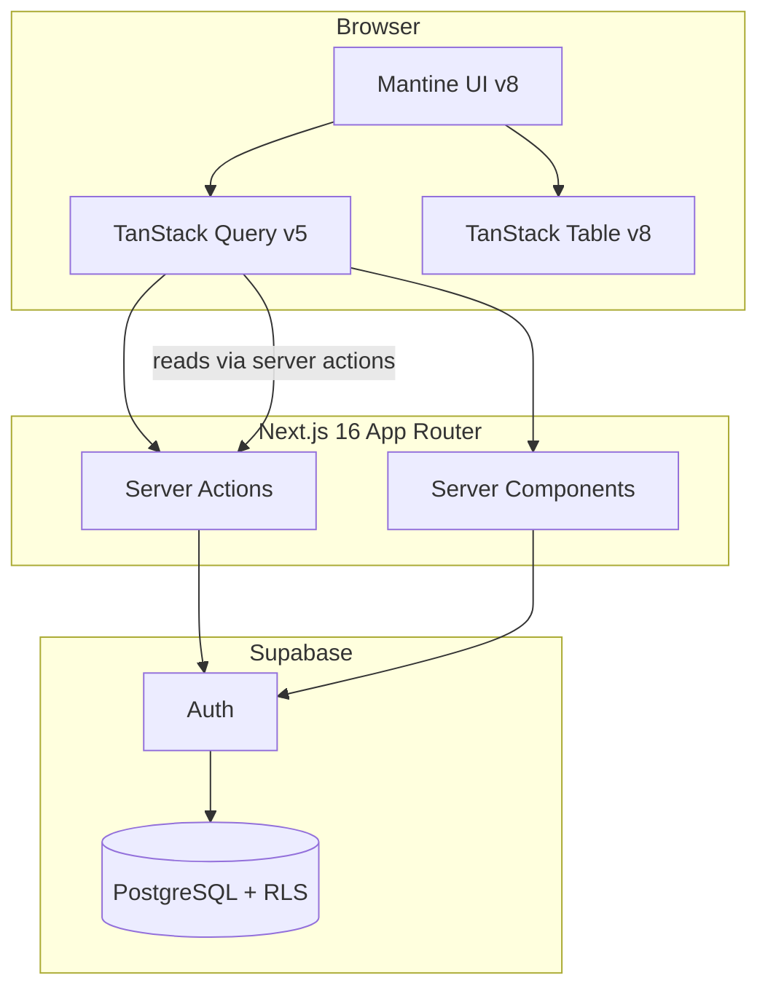

# Ops Tracker — architecture

This document describes the **current** architecture of Ops Tracker: a professional Kanban-based issue tracker and project management tool with authentication, role-based access, multi-project support, and admin workflows (see [README](../README.md)).

---

## Principles

1. **Server-first data** — Prefer React Server Components and Server Actions for mutations; keep secrets and authorization logic on the server.
2. **Defense in depth** — UI hides actions; **Supabase Row Level Security (RLS)** and server checks enforce permissions. Never trust the client for authorization.
3. **Feature boundaries** — Colocate domain code under `src/features/<domain>/` (components, hooks, actions, types, service, schemas); shared UI stays in `src/components/`. Hooks used only inside one feature live next to that feature; introduce `src/hooks/` only if you add truly cross-cutting client hooks.
4. **Explicit caching** — Use Next.js `revalidatePath` / `revalidateTag` and TanStack Query defaults tuned per resource (stale times, invalidation on mutation).
5. **Observable changes** — Append-only **audit log** for security-relevant and workflow events; optional **email** (Resend) for high-signal notifications.
6. **Performance by default** — Pagination or cursor-based lists; indexes in Postgres; TanStack Table with **virtualization** for large row counts; avoid over-fetching with column selection.

---

## High-level diagram



---

## Layers

| Layer | Responsibility |
|-------|----------------|
| **Routes** (`src/app/[locale]/...`) | Composition, layouts, metadata; thin pages that delegate to features. |
| **Features** (`src/features/*`) | Domain UI, hooks, server actions, service, schemas, types; role-aware entry points. |
| **Lib** (`src/lib/*`) | Supabase clients, `env`, shared auth helpers, audit logger, email wrapper, reCAPTCHA. |
| **Utils** (`src/utils/*`) | Pure, stateless helpers (e.g. SEO metadata). |
| **i18n** (`src/i18n/*`, `src/translations/*`) | `next-intl` routing config and locale message files (en / si / de). |
| **Database** | `user_profiles` + `app_role`; `projects`, `project_members`, `issue_statuses`, `issues`, `audit_log`; migrations in repo; RLS per role. |

---

## Route structure

```
src/app/[locale]/
├── layout.tsx                          # Workspace shell (nav, theme, providers)
├── page.tsx                            # Root redirect
├── login/
├── dashboard/
├── issues/
│   └── [id]/                           # Global issue detail (by UUID)
├── projects/
│   ├── page.tsx                        # Projects list
│   └── [projectKey]/
│       ├── board/                      # Kanban board
│       ├── issues/
│       │   ├── page.tsx                # Project issue list
│       │   └── [issueNumber]/          # Project-scoped issue detail
│       └── settings/                   # Project members & rename
└── admin/
    ├── page.tsx                        # Overview
    ├── users/
    ├── statuses/
    ├── audit/
    └── settings/                       # Super-admin flags & demo reset
```

---

## Feature modules (`src/features/`)

| Feature | Key files |
|---------|-----------|
| **issues** | `actions.ts`, `service.ts`, `schemas.ts`, `types.ts`, `keys.ts`, `issueTypeUtils.ts`, `permissions.ts`, `prefetch-issue-queries.ts`, `cache.ts`, `map-errors.ts`, `list-url-params.ts`, `issues-query-error.ts`; components: `IssueDetailPanel`, `IssuesListPageClient`, `IssuesVirtualizedTable`, `CreateIssueModal`, `AdminIssueStatusesPanel`; hooks: `useIssueDetail`, `useIssuesList`, `useIssueStatuses`, `useUpdateIssue`, `useAssignIssue`, `useTransitionIssueStatus`, `useAssigneeFilterOptions` |
| **projects** | `actions.ts`, `service.ts`, `schemas.ts`, `types.ts`, `keys.ts`; components: `ProjectBoardPageClient` (dnd-kit Kanban), `ProjectsListPageClient`, `ProjectSettingsPageClient`, `ProjectSubnav`; hooks: `useProjectsList`, `useProjectByKey`, `useProjectMembers` |
| **audit** | `actions.ts`, `service.ts`, `schemas.ts`, `types.ts`, `keys.ts`, `auditUtils.ts`; components: `AdminAuditLogPanel`, `IssueAuditActivitySection`; hooks: `useAdminAuditLogList`, `useIssueAuditActivity`, `useAuditTranslations` |
| **dashboard** | `getDashboardData.ts`; components: `DashboardOverview` |
| **users** | `actions.ts`, `service.ts`, `schemas.ts`, `types.ts`, `keys.ts`; components: `AdminUsersPanel`; hooks: `useAdminUsersList`, `useUpdateUserRole` |
| **settings** | `actions.ts`; components: `SuperAdminSettingsPanel`; hooks: `useResetDemoData` |
| **admin** | `components/AdminSubnav` |

---

## Key libraries

| Library | Version | Purpose |
|---------|---------|---------|
| `next` | 16 | App Router, Server Components, Server Actions |
| `react` | 19 | UI runtime |
| `@mantine/core` | 8 | Component library (Button, Select, Table, Modal, etc.) |
| `@mantine/form` | 8 | Form state and validation |
| `@mantine/hooks` | 8 | Utility hooks (useDisclosure, useDebouncedValue, …) |
| `@mantine/notifications` | 8 | Toast notifications |
| `@tabler/icons-react` | 3 | Icon set used throughout the UI |
| `@tanstack/react-query` | 5 | Client data fetching, caching, invalidation |
| `@tanstack/react-table` | 8 | Headless table (issues list) |
| `@tanstack/react-virtual` | 3 | Row virtualisation for large lists |
| `@dnd-kit/core` | 6 | Drag-and-drop for Kanban board |
| `next-intl` | 4 | i18n routing and message translation (en / si / de) |
| `react-country-flag` | 3 | SVG flag icons in the language switcher |
| `zod` | 4 | Schema validation for server action inputs |
| `@supabase/supabase-js` | 2 | Supabase client |
| `@supabase/ssr` | — | SSR-safe Supabase client helpers |
| `resend` | — | Transactional email delivery |
| `@playwright/test` | — | E2E test suite (`npm run test:e2e`) |

---

## Database — defined in Supabase

Migrations live in the repo; apply via `npm run db:push` (see [SUPABASE_MIGRATIONS.md](./SUPABASE_MIGRATIONS.md)).

**`user_profiles`**

| Column | Type | Notes |
|--------|------|--------|
| `id` | `uuid` | PK, FK → `auth.users.id` |
| `email` | `text` | `NOT NULL`, `UNIQUE` |
| `role` | `app_role` | `NOT NULL`; Postgres enum |
| `full_name` | `text` | Nullable |
| `created_at` / `updated_at` | `timestamptz` | `NOT NULL` |

**`projects`** — `id`, `key` (unique slug), `name`, `description`, `created_by`, `created_at`, `updated_at`

**`project_members`** — `project_id`, `user_id`, `role` (`member` / `admin`); composite PK

**`issue_statuses`** — `id`, `name`, `slug`, `sort_order`, `is_terminal`, `created_at`

**`issues`** — `id`, `project_id`, `issue_number` (per-project sequence), `issue_key` (e.g. `OPS-12`), `title`, `description`, `issue_type` (`bug` | `ticket`), `status_id`, `reporter_id`, `assignee_id`, `deleted_at` (soft delete), `created_at`, `updated_at`

**`audit_log`** — `id`, `actor_id`, `action` (e.g. `issue.status_transition`), `entity_type`, `entity_id`, `metadata` (jsonb), `created_at`

**Type `app_role`** — `user`, `admin`, `super_admin`

---

## Roles and authorization

| Role | Capabilities |
|------|-------------|
| **user** | View issues in assigned projects; transition own issue statuses. |
| **admin** | All issues; assign; manage project members; read audit log. |
| **super_admin** | System config; demo data reset; role management; rename projects; full audit. |

**Implementation:** `user_profiles.role` set at signup or by admin. Server Actions verify role before calling Supabase; RLS uses `auth.uid()` and `user_profiles.role` as a secondary layer. Critical permission checks are duplicated in SQL where practical.

---

## Data fetching strategy

- **Server Components:** Initial page data (SEO, first paint); prefetch + `HydrationBoundary` on detail routes.
- **TanStack Query:** Client lists, filters, pagination, optimistic updates; keys namespaced by locale and resource.
- **Mutations:** Server Actions return typed `IssuesActionResult<T>`; on success, invalidate Query keys or call `revalidatePath` / `revalidateTag` for RSC-heavy routes.
- **Prefetch pattern:** `prefetchIssueDetailPageQueries` in `src/features/issues/prefetch-issue-queries.ts` runs server-side and dehydrates into `HydrationBoundary` for the issue detail page.

---

## Issue type pattern

The DB stores `issue_type` as `"bug" | "ticket"` (Postgres enum). The UI displays these as **Bug** and **Task**. All comparisons go through `src/features/issues/issueTypeUtils.ts`:

```ts
export const IssueTypes = { BUG: "bug", TASK: "ticket" } as const;
export type IssueType = (typeof IssueTypes)[keyof typeof IssueTypes];
export const isIssueBug  = (t: IssueType) => t === IssueTypes.BUG;
export const isIssueTask = (t: IssueType) => t === IssueTypes.TASK;
```

If the DB enum is ever renamed, only `IssueTypes` needs updating.

---

## Audit and notifications

- **Audit:** `audit_log` table. App inserts via `src/lib/audit/log-audit.ts` after every successful mutation, including `issue_key` in metadata for traceability. Admin read UI under `src/features/audit/`. Shared helpers: `auditUtils.ts` (pure functions for action key mapping, colour, metadata preview) and `useAuditTranslations` hook (translates raw action keys to locale labels).
- **Email (Resend):** Optional `RESEND_API_KEY` and `RESEND_FROM` (server-only env; never `NEXT_PUBLIC_`). Helpers in `src/lib/email/` send HTML transactional mail (issue assigned, issue created); failures are logged and do not fail the mutation.

---

## i18n

`next-intl` with locale-prefixed routing. Three supported locales: **en**, **si** (Slovenian), **de** (German). Message files live in `src/translations/`. The language switcher uses `react-country-flag` for SVG flag icons.

---

## Deployment and env

- **Vercel** for hosting; Supabase URL and keys via `env()` pattern already in repo.
- **Node ≥ 20.19.0** required (`engines` field in `package.json`).
- Production: enable Supabase email or OAuth as needed; restrict CORS; review RLS in staging.

---

## Testing

- **E2E:** Playwright (`@playwright/test`). Run with `npm run test:e2e` or `npm run test:e2e:ui`. Critical-path spec covers login and issue workflows.
- **Lint / type-check:** `npm run lint` (ESLint with import-sort and unused-imports plugins) and `npm run tsc`.

---

## Evolution

- Add **real-time** (Supabase Realtime) for live board updates if required.
- Add **cursor-based keyset pagination** to replace the current offset-in-base64 cursor for better deep-page performance.
- Consider **JWT custom claims** for role to avoid an extra `user_profiles` round-trip per request.
