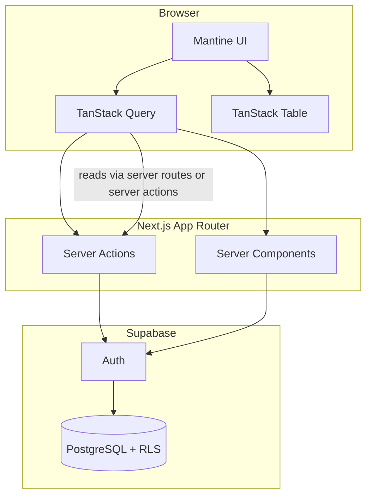

# Ops Tracker — target architecture

This document describes the **end-state** architecture for a scalable, optimized Ops Tracker: an operations and incident management dashboard with authentication, role-based access, large datasets, and admin workflows (see [README](../README.md)).

---

## Principles

1. **Server-first data** — Prefer React Server Components and Server Actions for mutations; keep secrets and authorization logic on the server.
2. **Defense in depth** — UI hides actions; **Supabase Row Level Security (RLS)** and server checks enforce permissions. Never trust the client for authorization.
3. **Feature boundaries** — Colocate domain code under `src/features/<domain>/` (components, hooks, actions, types); shared UI stays in `src/components/`. Hooks used only inside one feature live next to that feature; introduce `src/hooks/` only if you add truly cross-cutting client hooks.
4. **Explicit caching** — Use Next.js `cache` / `revalidateTag` / `revalidatePath` and TanStack Query defaults tuned per resource (stale times, invalidation on mutation).
5. **Observable changes** — Append-only **audit log** for security-relevant and workflow events; optional **email** (Resend) for high-signal notifications.
6. **Performance by default** — Pagination or cursor-based lists; indexes in Postgres; TanStack Table with **virtualization** when row counts are large; avoid over-fetching with column selection.

---

## High-level diagram

---

## Layers

| Layer | Responsibility |
|-------|----------------|
| **Routes** (`src/app/[locale]/...`) | Composition, layouts, metadata; thin pages that delegate to features. |
| **Features** (`src/features/*`) | Domain UI, hooks, server actions, queries; role-aware entry points. |
| **Lib** (`src/lib/*`) | Supabase clients, `env`, shared auth helpers, audit logger, email wrapper. |
| **Database** | `user_profiles` + `app_role`; `issue_statuses`, `issues`, `audit_log` (migrations in repo); RLS per role. |

---

## Database — already defined (Supabase)

The following is **fixed** in the backend; app code and new migrations should align with it (naming and FKs).

**Table `user_profiles`**

| Column | Type | Notes |
|--------|------|--------|
| `id` | `uuid` | PK, FK → `auth.users.id` (same id as Supabase Auth) |
| `email` | `text` | `NOT NULL`, `UNIQUE` |
| `role` | `app_role` | `NOT NULL`; Postgres enum for application roles |
| `full_name` | `text` | Nullable |
| `created_at` | `timestamptz` | `NOT NULL` |
| `updated_at` | `timestamptz` | `NOT NULL` |

**Type `app_role`** — must include at least the README roles (e.g. `user`, `admin`, `super_admin`); exact literals must match what you created in Supabase.

**Phase 1 (migrations in repo):** `issue_statuses`, `issues` (with `deleted_at`), and `audit_log`, plus RLS tied to `user_profiles.role`. Apply in Supabase per [SUPABASE_MIGRATIONS.md](./SUPABASE_MIGRATIONS.md). Further tables (e.g. org-scoped data) can follow the same patterns later.

---

## Roles and authorization

| Role | Capabilities (conceptual) |
|------|---------------------------|
| **user** | CRUD own scope of issues; update allowed statuses; search/filter. |
| **admin** | All issues; assign; manage users/statuses in scope; read audit. |
| **super_admin** | System config; demo data reset; role management; full audit. |

**Implementation:** `user_profiles.role` (`app_role`) set at signup (default) or by admin; JWT custom claims optional; RLS uses `auth.uid()` and role from `user_profiles`. Server Actions verify role before calling Supabase; duplicate critical checks in SQL where practical.

---

## Data fetching strategy

- **Server Components:** Initial page data where possible (SEO, first paint).
- **TanStack Query:** Client lists, filters, pagination, optimistic updates; keys namespaced by locale and filters.
- **Mutations:** Server Actions return typed results; on success, invalidate Query keys or call `revalidatePath` for RSC-heavy routes.

---

## Audit and notifications

- **Audit:** `audit_log` table (actor_id, action, entity_type, entity_id, metadata, created_at). App inserts via `src/lib/audit/log-audit.ts` after successful mutations; admin read UI under `src/features/audit/` (RLS: admin/super_admin select).
- **Email (Resend):** Optional `RESEND_API_KEY` and `RESEND_FROM` (server-only env; never `NEXT_PUBLIC_`). Helpers in `src/lib/email/` send HTML transactional mail from Server Actions (e.g. issue assigned, issue created); failures are logged and do not fail the mutation.

---

## Deployment and env

- **Vercel** for hosting; Supabase URL and keys via `env()` pattern already in repo.
- Production: enable Supabase email or OAuth as needed; restrict CORS; review RLS in staging.

---

## Evolution

- Add **real-time** (Supabase Realtime) for issue boards later if required.
- Add **E2E tests** (Playwright) for login and critical workflows once flows stabilize.

This file is stable reference; detailed execution order lives in [IMPLEMENTATION_PLAN.md](./IMPLEMENTATION_PLAN.md).
