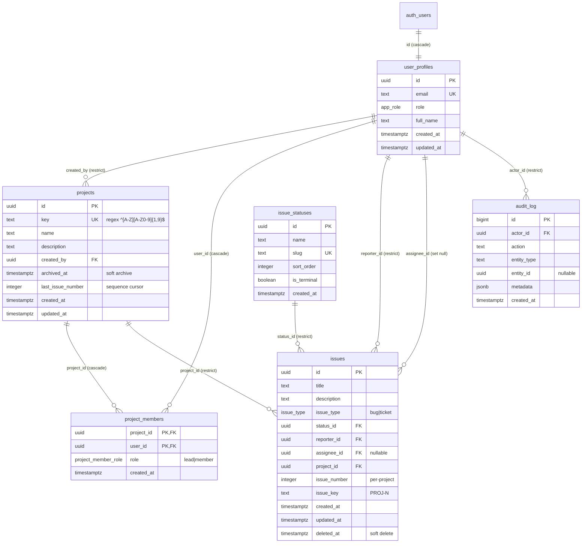

# Database architecture — Ops Tracker

A code-anchored map of the **Postgres / Supabase** schema that backs Ops Tracker: every table, enum, constraint, trigger, and row-level-security (RLS) policy that exists today, with the migration file or source line that defines it.

This document complements:

- `docs/ai/architecture/backend.md` (Server Actions, services, transaction patterns).
- `docs/ai/architecture/repository-overview.md` (system-wide map).
- `docs/ARCHITECTURE.md` and `docs/SUPABASE_MIGRATIONS.md` (top-level docs).

Where any of these disagree with the code, the migrations win.

---

## 1. Where the schema lives

- **All schema-changing SQL** lives in `supabase/migrations/`. Files are timestamp-prefixed and applied in name order. There is no app-side migration runner; `npm run db:push` invokes the Supabase CLI (`supabase/.gitignore`, `docs/SUPABASE_MIGRATIONS.md` §4).
- **There is no `supabase/seed.sql`** in the repo. Seeding for default issue statuses happens inside migrations (`20260403140000_phase1_issues_audit_statuses.sql` lines 92–98 and `20260413100000_issue_type_and_default_statuses.sql` lines 27–38).
- **One table is treated as a prerequisite, not as a migration:** `public.user_profiles` and the `app_role` enum. `docs/SUPABASE_MIGRATIONS.md` §1 ships the recommended `CREATE TABLE` and an optional `handle_new_user` trigger in documentation only — neither is committed under `supabase/migrations/`.

### Migration files (current, in apply order)

| # | File | What it adds |
|--:|------|--------------|
| 1 | `20260403140000_phase1_issues_audit_statuses.sql` | `issue_statuses`, `issues`, `audit_log`; `set_updated_at()` trigger fn; partial indexes; baseline RLS policies. |
| 2 | `20260405120000_user_profiles_admin_rls.sql` | First-pass `user_profiles` SELECT/UPDATE policies (later replaced by the recursion fix). |
| 3 | `20260411120000_phase12_list_sort_audit_indexes.sql` | List/filter/sort indexes for `issues` and `audit_log`. |
| 4 | `20260412140000_fix_user_profiles_rls_recursion.sql` | `SECURITY DEFINER` helpers `ops_auth_is_*`; replaces the three Phase 8 policies without self-referential `EXISTS`. |
| 5 | `20260412200000_projects_members_issues_scope.sql` | `projects`, `project_members`, project-scoped columns on `issues`, `ops_auth_can_access_project()`, three `issues` triggers; replaces issues RLS. |
| 6 | `20260413100000_issue_type_and_default_statuses.sql` | `issue_type` enum, `issues.issue_type` column; upserts canonical workflow statuses. |
| 7 | `20260413110000_remove_resolved_closed_statuses.sql` | Reassigns issues to `done`; deletes legacy `resolved`/`closed` statuses. |

---

## 2. Enums

All enums live in `public`.

| Enum | Values | Defined in | TypeScript mirror |
|------|--------|-----------|-------------------|
| `app_role` | `user`, `admin`, `super_admin` | **External prerequisite** (see `docs/SUPABASE_MIGRATIONS.md` §1; not in repo migrations) | `src/lib/auth/types.ts` `AppRoles` |
| `issue_type` | `bug`, `ticket` | `20260413100000_*.sql` lines 7–15 (idempotent `do$$`) | `src/features/issues/issueTypeUtils.ts` `IssueTypes` (UI labels: **Bug** / **Task**) |
| `project_member_role` | `lead`, `member` | `20260412200000_*.sql` line 7 | `src/features/projects/types.ts` `ProjectMemberRole` |

**Domain quirk:** `issue_type` storage value `ticket` renders as **Task** in the UI. Always compare via `src/features/issues/issueTypeUtils.ts` (`isIssueBug`, `isIssueTask`), never against the raw string.

---

## 3. Tables (reference)

There are **six** application tables. There is **no** `notifications` table; transactional notifications go out via Resend email (`src/lib/email/`) and in-app toast notifications use Mantine (`@mantine/notifications`, `src/components/Providers/AppNotifications.tsx`).

### 3.1 `user_profiles`

External prerequisite — **not** created by repo migrations. Recommended shape from `docs/SUPABASE_MIGRATIONS.md` §1:

| Column | Type | Notes |
|--------|------|-------|
| `id` | `uuid` | PK; `references auth.users(id) on delete cascade` |
| `email` | `text` | `not null`, `unique` |
| `role` | `app_role` | `not null`, default `'user'` |
| `full_name` | `text` | nullable |
| `created_at` | `timestamptz` | `not null`, default `now()` |
| `updated_at` | `timestamptz` | `not null`, default `now()` |

**Code that depends on this shape:** `src/lib/auth/session.ts:13–17` (selects `role, full_name` by `id`), `src/features/users/service.ts:18`, `src/features/audit/service.ts:20` (embed FK `audit_log_actor_id_fkey`), `src/features/issues/service.ts:40` (embed FK `issues_assignee_id_fkey`).

### 3.2 `issue_statuses`

Defined in `20260403140000_phase1_issues_audit_statuses.sql:10–17`.

| Column | Type | Notes |
|--------|------|-------|
| `id` | `uuid` | PK, `default gen_random_uuid()` |
| `name` | `text` | not null |
| `slug` | `text` | not null, **unique** |
| `sort_order` | `integer` | not null, default `0` |
| `is_terminal` | `boolean` | not null, default `false` |
| `created_at` | `timestamptz` | not null, default `now()` |

Canonical seed (after migration #6, with #7 having removed `resolved`/`closed`):

| Name | Slug | Sort | Terminal |
|---|---|---|---|
| Open | `open` | 0 | no |
| In Progress | `in_progress` | 10 | no |
| Ready for Deployment | `ready_for_deployment` | 20 | no |
| Testing | `testing` | 30 | no |
| Done | `done` | 40 | yes |

### 3.3 `projects`

Defined in `20260412200000_projects_members_issues_scope.sql:9–20`.

| Column | Type | Notes |
|--------|------|-------|
| `id` | `uuid` | PK, `default gen_random_uuid()` |
| `key` | `text` | not null, **unique**, check `~ '^[A-Z][A-Z0-9]{1,9}$'` |
| `name` | `text` | not null |
| `description` | `text` | nullable |
| `created_by` | `uuid` | not null, `references user_profiles(id) on delete restrict` |
| `archived_at` | `timestamptz` | nullable — soft archive (`src/features/projects/service.ts:121`) |
| `last_issue_number` | `integer` | not null, default `0` — bumped by `issues_before_insert_set_number` trigger |
| `created_at`, `updated_at` | `timestamptz` | not null; `updated_at` maintained by `set_updated_at` trigger |

The `OPS` project is created and back-filled by lines 66–97 of the same migration (only when no project with `key='OPS'` exists). The first existing user (by `created_at asc`) becomes `created_by` and is later promoted to `lead` on `project_members` (lines 113–121).

### 3.4 `project_members`

Defined in `20260412200000_*.sql:24–30`.

| Column | Type | Notes |
|--------|------|-------|
| `project_id` | `uuid` | not null, `references projects(id) on delete cascade` |
| `user_id` | `uuid` | not null, `references user_profiles(id) on delete cascade` |
| `role` | `project_member_role` | not null, default `'member'` |
| `created_at` | `timestamptz` | not null, default `now()` |

**PK:** composite `(project_id, user_id)`. There is no surrogate id.

### 3.5 `issues`

Defined in `20260403140000_*.sql:24–34`, then extended by `20260412200000_*.sql:39–46` and `20260413100000_*.sql:20–21`.

| Column | Type | Notes |
|--------|------|-------|
| `id` | `uuid` | PK, `default gen_random_uuid()` |
| `title` | `text` | not null |
| `description` | `text` | nullable |
| `issue_type` | `issue_type` | not null, default `'ticket'` (added in migration #6) |
| `status_id` | `uuid` | not null, `references issue_statuses(id) on delete restrict` |
| `reporter_id` | `uuid` | not null, `references user_profiles(id) on delete restrict` |
| `assignee_id` | `uuid` | nullable, `references user_profiles(id) on delete set null` |
| `project_id` | `uuid` | not null (after backfill), `references projects(id) on delete restrict` |
| `issue_number` | `integer` | not null (after backfill); per-project sequence |
| `issue_key` | `text` | not null (after backfill); `'<projects.key>-<issue_number>'` |
| `created_at`, `updated_at` | `timestamptz` | not null; `updated_at` via `set_updated_at` trigger |
| `deleted_at` | `timestamptz` | nullable — **soft delete** marker (see §6) |

**Per-project sequence uniqueness:** `unique index issues_project_issue_number_uidx on (project_id, issue_number)` (`20260412200000_*.sql:186`).

### 3.6 `audit_log`

Defined in `20260403140000_*.sql:57–65`. Append-only by RLS (no UPDATE/DELETE policies, no UPDATE/DELETE grants).

| Column | Type | Notes |
|--------|------|-------|
| `id` | `bigint` | PK, `generated always as identity` |
| `actor_id` | `uuid` | not null, `references user_profiles(id) on delete restrict` |
| `action` | `text` | not null — namespaced string, e.g. `issue.status_transition` |
| `entity_type` | `text` | not null — e.g. `issue`, `project`, `user_profile` |
| `entity_id` | `uuid` | nullable |
| `metadata` | `jsonb` | not null, default `'{}'::jsonb` (mutations include `issue_key` for traceability — see `.cursor/rules/architecture.mdc`) |
| `created_at` | `timestamptz` | not null, default `now()` |

Insert-side helper: `src/lib/audit/log-audit.ts` — RLS forces `actor_id = auth.uid()`. Failures are logged and **do not fail the user mutation** (except `resetDemoData`, which surfaces `settings.errors.auditFailed`).

---

## 4. Relationships and ER diagram

### 4.1 Mermaid ER diagram

### 4.2 Foreign-key matrix (verbatim from migrations)

| From | Column | → To | On delete | Defined |
|------|--------|------|-----------|---------|
| `user_profiles` | `id` | `auth.users(id)` | `cascade` | `docs/SUPABASE_MIGRATIONS.md` §1 (prerequisite) |
| `projects` | `created_by` | `user_profiles(id)` | `restrict` | `20260412200000_*.sql:14` |
| `project_members` | `project_id` | `projects(id)` | `cascade` | `20260412200000_*.sql:25` |
| `project_members` | `user_id` | `user_profiles(id)` | `cascade` | `20260412200000_*.sql:26` |
| `issues` | `status_id` | `issue_statuses(id)` | `restrict` | `20260403140000_*.sql:28` |
| `issues` | `reporter_id` | `user_profiles(id)` | `restrict` | `20260403140000_*.sql:29` |
| `issues` | `assignee_id` | `user_profiles(id)` | `set null` | `20260403140000_*.sql:30` |
| `issues` | `project_id` | `projects(id)` | `restrict` | `20260412200000_*.sql:40` |
| `audit_log` | `actor_id` | `user_profiles(id)` | `restrict` | `20260403140000_*.sql:59` |

**Note on PostgREST embed names** (used by services that don't ship typed schema):

- `issues_assignee_id_fkey` — used in `src/features/issues/service.ts:40` (`assignee:user_profiles!issues_assignee_id_fkey (...)`).
- `audit_log_actor_id_fkey` — used in `src/features/audit/service.ts:20` (`actor:user_profiles!audit_log_actor_id_fkey (...)`).

These FK constraint names are the **default Postgres-generated names** (`<table>_<column>_fkey`); migrations don't name them explicitly.

---

## 5. Ownership and access patterns

| Concept | How it's modelled | Where it lives |
|---------|-------------------|----------------|
| **Workspace identity** | `user_profiles.id` ↔ `auth.users.id` (1:1, cascade on auth deletion) | `auth.users` (Supabase) + `public.user_profiles` |
| **Global role** | `user_profiles.role` (`user` / `admin` / `super_admin`) | `user_profiles` |
| **Project access** | Membership row in `project_members` for a user, **or** any staff role | Enforced by `ops_auth_can_access_project(uuid)` (`20260412200000_*.sql:191–208`) |
| **Project leadership** | `project_members.role = 'lead'` (vs. `member`) | Auto-assigned to `projects.created_by` for the OPS backfill (`20260412200000_*.sql:113–121`) |
| **Issue authorship** | `issues.reporter_id` (FK restrict — cannot delete a reporting user without first dealing with their issues) | `issues` |
| **Issue assignment** | `issues.assignee_id` (FK set null — assignee deletion silently un-assigns) | `issues` |
| **Audit ownership** | `audit_log.actor_id` (FK restrict — actors are immortal in audit) | `audit_log` |

### 5.1 Project creator vs. project lead

`projects.created_by` is purely a record column with `on delete restrict`. It does **not** automatically promote that user to `lead` on `project_members`. The migration backfill does this manually for the OPS project (lines 113–121); for new projects created via `src/features/projects/service.ts:65–106` (`createProject`), the action **explicitly inserts** the creator as `lead` after creating the project. If that second insert fails the project row is best-effort deleted — see `docs/ai/architecture/backend.md` §6.1.

---

## 6. Soft delete and archive strategy

Two distinct soft-delete mechanisms exist; they apply to different entities.

| Entity | Column | Semantics | Hard delete possible? |
|--------|--------|-----------|------------------------|
| `issues` | `deleted_at timestamptz` | Hidden from non-staff via RLS; staff see them. **No app path performs a hard delete of issues.** | RLS allows staff to DELETE (`issues_delete_admin`), but no Server Action calls it; only `resetDemoData` deletes from `issues` directly (`src/features/settings/actions.ts:49`). |
| `projects` | `archived_at timestamptz` | List views filter by `is("archived_at", null)` (`src/features/projects/service.ts:28`). RLS does **not** itself filter on `archived_at`; this is a service-layer concern. | Yes; staff can DELETE per `projects_delete_staff`. No app action does so. |

`project_members`, `issue_statuses`, `audit_log` and `user_profiles` have **no soft-delete column**; deletes are hard (or, for `audit_log`, simply not allowed by grants/policies).

### 6.1 Soft delete and indexes

Every list-oriented index on `issues` is partial: `where deleted_at is null`. Switching to "include closed" (the UI flag) bypasses these indexes and falls back to full-table scans on filtered subsets — see §7.

---

## 7. Indexing strategy

All indexes are explicitly defined in migrations.

### 7.1 `issues`

Partial indexes (active rows only — `where deleted_at is null`), defined in `20260403140000_*.sql:38–52` and `20260412200000_*.sql:48–54`:

- `issues_status_id_idx (status_id)`
- `issues_assignee_id_idx (assignee_id)`
- `issues_reporter_id_idx (reporter_id)`
- `issues_created_at_idx (created_at desc)`
- `issues_project_id_idx (project_id)`
- `issues_project_status_idx (project_id, status_id)`

List-/sort-tuned partial indexes from `20260411120000_phase12_list_sort_audit_indexes.sql`:

- `issues_updated_at_idx (updated_at desc, id desc)` — default list sort.
- `issues_title_sort_idx (title asc, id asc)` — alphabetical sort.
- `issues_status_created_id_idx (status_id, created_at desc, id desc)` — filter by status, ordered by recency.
- `issues_assignee_created_id_idx (assignee_id, created_at desc, id desc) where deleted_at is null and assignee_id is not null` — **double partial** (excludes both deleted rows and unassigned rows).

Unique index for the per-project sequence: `issues_project_issue_number_uidx (project_id, issue_number)` (`20260412200000_*.sql:186`).

### 7.2 `audit_log`

Defined in `20260403140000_*.sql:69–71` and `20260411120000_*.sql:32–39`:

- `audit_log_created_at_idx (created_at desc)` — newest-first global feed.
- `audit_log_entity_idx (entity_type, entity_id)` — entity lookups.
- `audit_log_entity_created_idx (entity_type, created_at desc)` — admin filter by entity type, newest first.
- `audit_log_entity_type_id_created_idx (entity_type, entity_id, created_at desc)` — `listAuditLogsForEntity`-style queries (issue activity stream).

### 7.3 `project_members`

- PK `(project_id, user_id)` (covers project-scoped membership lookups).
- `project_members_user_id_idx (user_id)` — reverse lookup for "projects this user is in" (`20260412200000_*.sql:34`).

### 7.4 No explicit indexes

`issue_statuses`, `projects`, `user_profiles` rely on the implicit unique index over their PK and on the unique-column indexes (`slug`, `key`, `email`).

---

## 8. Constraints

### 8.1 Check constraints

| Table | Constraint | Source |
|-------|-----------|--------|
| `projects` | `projects_key_format` — `key ~ '^[A-Z][A-Z0-9]{1,9}$'` (uppercase-leading, 2–10 chars) | `20260412200000_*.sql:19` |

### 8.2 Unique constraints

| Table | Column(s) | Source |
|-------|-----------|--------|
| `user_profiles` | `email` | `docs/SUPABASE_MIGRATIONS.md` §1 (prerequisite) |
| `issue_statuses` | `slug` | `20260403140000_*.sql:13` |
| `projects` | `key` | `20260412200000_*.sql:11` |
| `issues` | `(project_id, issue_number)` | unique index `issues_project_issue_number_uidx` |

### 8.3 Not-null defaults worth knowing

- `issues.issue_type` defaults to `'ticket'` (existing rows back-filled by ALTER, `20260413100000_*.sql:20`).
- `audit_log.metadata` defaults to `'{}'::jsonb` (so callers can omit it).
- `projects.last_issue_number` defaults to `0` (the trigger increments to `1` on the first insert).

### 8.4 Mapping DB error codes → translation keys

`src/features/issues/map-errors.ts` and the per-feature `service.ts` files translate Postgres errors into translation keys consumed by the UI:

- `23503` (FK violation) on `issues.status_id` → `"statuses.deleteInUse"` (`src/features/issues/service.ts:505`).
- `23505` (unique violation) on `issue_statuses.slug` → `"statuses.slugTaken"`.
- `23505` on `projects.key` → `"projects.errors.keyTaken"`.
- `23505` on `project_members` PK → `"projects.errors.alreadyMember"`.
- Any error message containing `row-level security` / `policy` → `"errors.forbidden"`.

---

## 9. Triggers

All trigger functions live in `public`. They are the **only** procedural code in the database.

| Trigger fn | Language / volatility | Triggers | Behavior |
|-----------|-----------------------|----------|----------|
| `set_updated_at()` | `plpgsql` | `issues_set_updated_at` (BEFORE UPDATE on `issues`), `projects_set_updated_at` (BEFORE UPDATE on `projects`) | Sets `new.updated_at = now()`. |
| `issues_before_insert_set_number()` | `plpgsql security definer set search_path = public` | `issues_before_insert_set_number` (BEFORE INSERT on `issues`) | If `new.project_id` is null → raise. Otherwise atomically `update projects set last_issue_number = last_issue_number + 1 ... returning last_issue_number` and stamps `new.issue_number` and `new.issue_key` as `'<projects.key>-<n>'`. |
| `issues_before_write_check_members()` | `plpgsql security definer` | `issues_before_insert_check_members` and `issues_before_update_check_members` (both on `issues`) | Raises `'reporter must be a project member'` or `'assignee must be a project member (or null)'` when corresponding `project_members` row is missing. |
| `issues_before_update_sync_key()` | `plpgsql security definer` | `issues_before_update_sync_key` (BEFORE UPDATE on `issues`) | If `project_id` or `issue_number` changes, recomputes `issue_key`. |

All four are defined in `20260403140000_*.sql` (the generic `set_updated_at`) and `20260412200000_*.sql` lines 219–338 (the rest). The three `SECURITY DEFINER` triggers exist so that the PostgREST-issued `update projects ...` inside them can bypass `projects_update_staff` RLS for the inner sequence-allocation step.

---

## 10. Row-level security

RLS is enabled on all six application tables (`alter table ... enable row level security` in their respective migrations; see `20260403140000_*.sql:103–107`, `20260412200000_*.sql:343/363`, and `docs/SUPABASE_MIGRATIONS.md` §5 for `user_profiles`).

### 10.1 Helper functions

Defined in `20260412140000_fix_user_profiles_rls_recursion.sql` and `20260412200000_*.sql:191–208`. All four are `language sql stable security definer set search_path = public`, with `revoke all from public` and `grant execute to authenticated`.

| Function | Returns | Used by |
|----------|---------|---------|
| `ops_auth_is_super_admin()` | `boolean` | `phase8_user_profiles_update_super_admin` |
| `ops_auth_is_admin()` | `boolean` | `phase8_user_profiles_update_admin_user_rows` |
| `ops_auth_is_staff()` | `boolean` | `issue_statuses_*`, `audit_log_*`, `projects_*`, `project_members_*`, issues policies, and inside `ops_auth_can_access_project` |
| `ops_auth_can_access_project(uuid)` | `boolean` | `projects_select_access`, `project_members_select_access`, `issues_select_visible`, `issues_insert_reporter_self`, `issues_update_member` |

### 10.2 Policy matrix (current state)

Every policy below has been verified against the migration files. Policies are written for the `authenticated` role only; the `anon` role has no grants and no policies on any application table.

| Table | SELECT | INSERT | UPDATE | DELETE |
|-------|--------|--------|--------|--------|
| `user_profiles` | `id = auth.uid()` **or** `ops_auth_is_staff()` | — (no policy in repo; relies on signup trigger / dashboard inserts) | super-admin: any row; admin: only rows where current `role = 'user'` and new role ∈ `('user','admin')` | — (no policy in repo) |
| `issue_statuses` | `true` (any authenticated) | staff | staff | staff |
| `projects` | `ops_auth_can_access_project(id)` | staff | staff | staff |
| `project_members` | `ops_auth_can_access_project(project_id)` | staff | staff | staff |
| `issues` | `(deleted_at is null and ops_auth_can_access_project(project_id))` **or** `(deleted_at is not null and ops_auth_is_staff())` | `reporter_id = auth.uid() and ops_auth_can_access_project(project_id)` | staff (any) **or** users with `role='user'` on rows where `deleted_at is null and ops_auth_can_access_project(project_id) and (reporter_id = auth.uid() or assignee_id = auth.uid())` | staff |
| `audit_log` | staff | `actor_id = auth.uid()` | — (no policy) | — (no policy) |

### 10.3 Grants

`grant select, insert, update, delete to authenticated` is issued for `issue_statuses`, `issues`, `projects`, `project_members`. `audit_log` is **`select, insert` only** (`20260403140000_*.sql:302–304`), making it append-only at the grant level (a defense layer below the missing UPDATE/DELETE policies).

### 10.4 Why `SECURITY DEFINER` helpers are necessary

Migration #4 (`20260412140000_*.sql`) was created specifically to unblock Postgres error `42P17 — infinite recursion detected in policy for relation user_profiles`. The original Phase 8 policies used `EXISTS (SELECT 1 FROM user_profiles WHERE …)`, which re-triggers the same RLS policy on every evaluation. The fix replaces those expressions with calls to `SECURITY DEFINER` helpers, which run with definer rights and skip RLS on the inner read.

This is the only sanctioned way to read role/membership state from inside a policy in this database. Any new policy that needs to look at `user_profiles.role` or `project_members` must reuse `ops_auth_is_staff()` / `ops_auth_can_access_project(uuid)` — never inline `EXISTS`.

---

## 11. Supabase Auth integration

- **Auth provider:** `auth.users` is owned by Supabase Auth. The app never inserts into it.
- **Bridge to app data:** `public.user_profiles.id` is a 1:1 FK to `auth.users.id` (`on delete cascade`). Removing an auth user removes their profile, which then cascades to `project_members` and (because of `restrict` FKs) **fails** if they have any issues or audit rows.
- **Profile creation:** `docs/SUPABASE_MIGRATIONS.md` §7 ships an example `handle_new_user` trigger (`after insert on auth.users`) that inserts a default `user_profiles` row. This trigger is **not** committed under `supabase/migrations/`; it must be created manually in the Supabase project.
- **Session reading:** `src/lib/auth/session.ts` wraps `supabase.auth.getUser()` and then reads `user_profiles.role` / `full_name`. If the profile row is missing or the role string is unrecognized, `getUserAuthContext` returns `null` and Server Actions return `errors.unauthorized` — see `docs/ai/architecture/backend.md` §7.
- **Login flow:** `src/components/Pages/LoginPage/LoginPage.tsx` `signInAction` calls `supabase.auth.signInWithPassword` after a server-side reCAPTCHA verification. Sign-out (`src/lib/auth/actions.ts:7`) calls `supabase.auth.signOut()`.
- **Cookies / SSR:** All three Supabase clients (`src/lib/supabase/{server,proxy,client}.ts`) are constructed via `@supabase/ssr`, which manages auth cookies. Cookie rotation happens in `src/proxy.ts` (the project's renamed middleware — there must not also be a `src/middleware.ts`, see `.cursor/rules/architecture.mdc`).

There is **no service-role key** in the codebase (verified by `Grep` for `SERVICE_ROLE` / `service_role` across `src/`). All queries, including audit inserts, run as the authenticated user under RLS.

---

## 12. Migration strategy and conventions

Observed conventions across the seven committed migrations:

1. **File naming:** `<UTC timestamp>_<snake_case_description>.sql`. Apply order is filename order.
2. **Idempotency where reasonable:**
   - `create index if not exists ...` (e.g. `20260411120000_*.sql:5,9,14,22`).
   - `add column if not exists ...` (e.g. `20260412200000_*.sql:39–46`, `20260413100000_*.sql:20`).
   - Enum creation guarded by `do$$ ... if not exists ... end$$;` (`20260413100000_*.sql:7–15`).
   - Status seed is `insert ... on conflict (slug) do nothing` (Phase 1) or `do update set ...` (migration #6).
3. **Backfill before tightening:** new columns on `issues` (`project_id`, `issue_number`, `issue_key`) are added nullable, populated via UPDATE, then promoted to `not null` (`20260412200000_*.sql:177–184`).
4. **Drop-and-recreate for policies:** when a migration changes RLS, it drops the old policies by name first (`20260412200000_*.sql:383–391`, `20260412140000_*.sql:72–76`).
5. **No migration ever drops a table or a column.** All schema growth is forward-only as of today.
6. **Manual rollout possible.** `docs/SUPABASE_MIGRATIONS.md` §3 documents copy-paste-into-SQL-Editor as a first-class apply path; the CLI path (`npm run db:push`) is §4.

There is **no `supabase/config.toml` committed** (the file pattern is excluded by `supabase/.gitignore`); each environment is linked locally via `npm run db:link`.

---

## 13. Audit table — design notes

- **Append-only by grants** — `audit_log` only has `select, insert` granted to `authenticated`; there is no UPDATE/DELETE policy and no DELETE/UPDATE grant. Even `super_admin` cannot edit history without the service role.
- **Self-asserting actor** — `audit_log_insert_self` policy forces `actor_id = auth.uid()`. A compromised admin Server Action cannot forge `actor_id`.
- **Free-form `action` and `entity_type`** — both are plain `text`, not enums. The conventions live in code and i18n keys (`src/features/audit/auditUtils.ts`, translation files), not the DB. **No CHECK constraint enforces this** — see §16.
- **Metadata convention** — every mutation includes `issue_key` in `metadata` for traceability (`.cursor/rules/architecture.mdc`); this is enforced only by review.
- **Not transactional with the originating mutation.** See `docs/ai/architecture/backend.md` §6.4: `logAudit` failure leaves a successful mutation un-audited, with only a stderr log.

---

## 14. Notification-related tables

**There are none.** Ops Tracker's "notifications" come in two flavors, neither persisted in the database:

- **In-app toasts** — `@mantine/notifications` via `src/components/Providers/AppNotifications.tsx` and per-feature hooks (`src/features/issues/hooks/useAssignIssue.ts`, etc.).
- **Email** — Resend, sent from `src/lib/email/send-issue-created-email.ts` and `src/lib/email/send-issue-assigned-email.ts`. These run after the originating Server Action commits, never throw, and never affect the action result. Recipients are looked up live from `issues` and `user_profiles` (e.g. `src/lib/email/send-issue-assigned-email.ts:31–36`); **no outbox table exists**.

If durable, retryable, or read-receipt-bearing notifications are ever required, they will need a new table (and a corresponding RLS strategy) — none exist today.

---

## 15. Dangerous coupling areas

These are real-today risks, not speculation. Each is anchored to a specific file/line.

1. **`audit_log + originating mutation` are not atomic.**
   `Server Action → service.update(...) → logAudit(...)` are three separate PostgREST calls. A `logAudit` failure leaves the database mutated but un-audited; only `console.error` records it. See `src/lib/audit/log-audit.ts:26–28`.

2. **`issues.assignee_id` silently becomes `null` when an assignee is removed.**
   FK is `on delete set null`. There is no audit row written by the database to record the un-assignment (the trigger has no notion of audit). If a user is deleted via Supabase Auth, all issues assigned to them lose their assignee with no audit trace.

3. **`projects.created_by` uses `on delete restrict`, but cascade-on-auth-delete still works for `user_profiles`.**
   Deleting an `auth.users` row cascades into `user_profiles`, which then **fails** the `projects.created_by` restrict, **fails** `issues.reporter_id` restrict, and **fails** `audit_log.actor_id` restrict. Practical effect: you cannot delete an auth user who has ever created a project, reported an issue, or done anything audited — without first re-pointing those rows. There is no app code that handles this.

4. **Project creator is not automatically a `lead` member.**
   `projects.created_by` and `project_members.role = 'lead'` are independent. Migration #5 manually wires this for OPS (lines 113–121); `src/features/projects/service.ts:65–106` (`createProject`) replicates it via two separate inserts; if the second insert fails the rollback is best-effort delete (line 98). RLS does not enforce that `created_by` must be a member.

5. **`resetDemoData` is not transactional.**
   `src/features/settings/actions.ts:48–73` runs three deletes sequentially (`issues`, then `project_members`, then `projects`). A failure in step 2 leaves orphans (well, only project rows — there are no remaining issues, but there are zero members). The action returns `errorKey: "settings.errors.resetFailed"` with no compensation.

6. **`issues_before_insert_set_number` mutates `projects.last_issue_number` even on a transaction that subsequently rolls back.**
   The `update projects set last_issue_number = last_issue_number + 1 ... returning ...` runs inside the same statement as the failing INSERT, so Postgres rolls it back as expected. **However**, two parallel inserts to the same project will block each other on the `last_issue_number` update — the trigger is correct but is a **per-project serialization point**. Bulk inserts into a single project will not parallelize.

7. **Soft-deleted issues become invisible to non-staff via RLS, but list services also filter `deleted_at` on the application side.**
   Both the policy `issues_select_visible` and `src/features/issues/service.ts` (e.g. `is("deleted_at", null)` paths) enforce this. The redundancy is intentional defense-in-depth, but means changing soft-delete semantics requires editing **both** layers.

8. **`user_profiles` has no INSERT policy committed in this repo.**
   The Phase 8 migration creates SELECT and UPDATE policies; the `handle_new_user` trigger that inserts on signup runs as `SECURITY DEFINER` and bypasses RLS. If RLS is enabled on `user_profiles` **and** the trigger is missing **and** the app is later refactored to insert profiles client-side, signups will silently fail with a policy violation. `docs/SUPABASE_MIGRATIONS.md` §5 warns about this.

9. **No CHECK constraint on `audit_log.action` or `audit_log.entity_type`.**
   A typo in a Server Action's `action` string is committed as-is. Filtering and translation depends on exact-string match (`src/features/audit/auditUtils.ts`), so a typo silently produces an "unknown action" label without throwing.

10. **PostgREST embed FK names (`issues_assignee_id_fkey`, `audit_log_actor_id_fkey`) are referenced as string literals in TypeScript** (`src/features/issues/service.ts:40`, `src/features/audit/service.ts:20`). They depend on Postgres's default constraint-naming convention. Renaming the constraint in a future migration without updating the string would silently break the embed.

---

## 16. Missing / weak constraints (visible from code today)

These are gaps that the schema **does not** enforce; current correctness relies on application code or convention.

| What | Where the only enforcement lives | Risk |
|------|----------------------------------|------|
| `projects.created_by` must be a project member | None — neither RLS nor a CHECK enforces it | A staff user can create a project and never appear in `project_members` |
| `audit_log.action` must follow `'<entity>.<verb>'` namespacing | Convention + `src/features/audit/auditUtils.ts` | Typos silently labelled "unknown" |
| `audit_log.entity_type` must be one of a known set | Convention | Same |
| `audit_log.metadata.issue_key` must be present on issue mutations | `.cursor/rules/architecture.mdc` (review-time) | Silent data quality regression |
| `issue_statuses.sort_order` should be unique per workflow | None — duplicates are accepted | Two statuses with same sort_order render in arbitrary order |
| `issue_statuses.is_terminal` should be true on at least one row | None | A workflow with no terminal status is structurally legal |
| `projects.archived_at` should hide projects from non-staff | Service-layer filter only (`src/features/projects/service.ts:28`) — RLS does not look at `archived_at` | A direct PostgREST query bypassing the service can still return archived projects |
| `issues` must have at most one INSERT policy producing the row | Single policy today (`issues_insert_reporter_self`) | If a future migration adds a second INSERT policy, both checks must pass — easy to forget |
| `user_profiles` INSERT path | Documented `handle_new_user` trigger only (not in repo migrations) | Easy to forget when bootstrapping a new Supabase project |
| `issues.deleted_at` must always be set with audit | Enforced by Server Action only (`softDeleteIssue` in `src/features/issues/actions.ts`) | A direct staff `update issues set deleted_at = now()` via PostgREST passes RLS but emits no audit row |
| `project_members` removal of last `lead` | None — you can delete the only lead and leave a project lead-less | App code does not check, RLS does not check |

None of these are necessarily wrong — they are explicit trade-offs the schema currently makes. They are listed here so future work that depends on them being enforced doesn't assume they are.

---

## 17. Cross-references

- Server-side execution model (clients, Server Actions, services, transactions): `docs/ai/architecture/backend.md`.
- Frontend data-fetching, query keys, hydration: `docs/ai/architecture/frontend.md`.
- Manual setup, prerequisite SQL, `handle_new_user` trigger template: `docs/SUPABASE_MIGRATIONS.md`.
- High-level summary of tables: `docs/ARCHITECTURE.md` §"Database — defined in Supabase".
- Domain-quirk reminder for `issue_type`: `.cursor/rules/architecture.mdc` "Issue type mapping".
